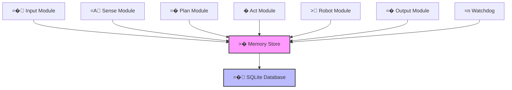

# > Robot Control System

[](https://python.org)
[](https://mujoco.org)
[](https://sqlite.org)
[](LICENSE)

> =� A comprehensive, real-time robotic arm control system with advanced monitoring, safety features, and intuitive mouse-based end-effector control.

## =� Table of Contents

- [( Features](#-features)
- [<� Architecture](#-architecture)
- [=� Quick Start](#-quick-start)
- [=� Installation](#-installation)
- [<� Usage](#-usage)
- [>� Testing](#-testing)
- [=� Monitoring](#-monitoring)
- [=� Configuration](#-configuration)
- [=' Development](#-development)
- [> Contributing](#-contributing)
- [=� License](#-license)

## ( Features

### <� Core Capabilities
- **<� Intuitive Mouse Control**: Direct 6-DOF end-effector control using mouse movement and scroll
- **=
 Real-time Monitoring**: Comprehensive system health monitoring with automatic failure recovery
- **=� Advanced Safety**: Emergency stop, collision detection, and workspace boundary protection
- **� High Performance**: Multi-threaded architecture with SQLite-backed memory system
- **>� Intelligent Planning**: Trajectory planning with obstacle avoidance and smooth motion execution
- **=� Multi-Modal Input**: Support for keyboard shortcuts, mouse control, and programmatic commands

### <� System Architecture
- **= Modular Design**: Sense � Plan � Act control loop with watchdog monitoring
- **=� Persistent Memory**: SQLite database with real-time caching for system state management
- **=' Hardware Abstraction**: Support for both MuJoCo simulation and real robot hardware
- **=� Performance Metrics**: Built-in profiling and system performance monitoring
- **= Thread Safety**: Robust multi-threaded design with proper synchronization

## <� Architecture



### =� Module Overview

| Module | <� Purpose | =� Frequency |
|--------|-------------|--------------|
| =� **Input** | Mouse/keyboard input processing | ~60Hz |
| =A **Sense** | Robot state sensing and monitoring | ~100Hz |
| =� **Plan** | Trajectory planning and path generation | ~10Hz |
| � **Act** | Control command generation and execution | ~50Hz |
| > **Robot** | Hardware interface and safety monitoring | ~100Hz |
| =� **Output** | Visual feedback and logging | ~30Hz |
| =n **Watchdog** | System health monitoring and recovery | ~1Hz |

## =� Quick Start

### <� Mouse Control Demo

```bash
# Start the system with mouse control enabled
python main.py --config configs/mouse_control.yaml

# Controls:
# =� Mouse XY � End-effector XY position
# <� Scroll wheel � End-effector Z position  
# <� Escape key � Emergency stop
# =� Space bar � Toggle control
```

### =� System Monitor

```bash
# View real-time system status
python tools/system_monitor.py

# Check system health
python tools/health_check.py
```

## =� Installation

### =� Prerequisites

- =
 Python 3.12+
- =� Operating System: Linux (recommended), Windows, macOS
- =' Hardware: Multi-core CPU recommended for real-time performance

### =' Setup

1. **=� Clone the repository:**
```bash
git clone <repository-url>
cd robot_control_system
```

2. **=
 Install dependencies:**
```bash
# Using uv (recommended)
uv sync

# Or using pip (if uv not available)
pip install -r requirements.txt
```

3. **=� Initialize database:**
```bash
python -c "from core.memory import GlobalMemory; GlobalMemory()"
```

4. ** Verify installation:**
```bash
python run_tests.py
```

## <� Usage

### =� Basic Operation

```python
from main import RobotControlSystem

# Initialize system
system = RobotControlSystem()

# Start all modules
system.start()

# System runs until stopped
try:
    system.run()
except KeyboardInterrupt:
    system.stop()
```

### <� Mouse Control

```python
from modules.input import InputModule

# Enable mouse end-effector control
input_module = InputModule({
    'mouse_control': {
        'enable_end_effector_control': True,
        'workspace_bounds': {
            'x': [0.2, 0.8],
            'y': [-0.4, 0.4], 
            'z': [0.1, 0.6]
        }
    }
})
```

### =� Monitoring

```python
from modules.watchdog import WatchdogModule

# Get system health
watchdog = WatchdogModule(config)
health_score = watchdog.get_system_health_score()
print(f"System Health: {health_score}% =�")
```

## >� Testing

### <� Run All Tests

```bash
# Comprehensive test suite
python run_tests.py

# Specific test categories
python -m pytest tests/test_memory.py -v          # =� Memory tests
python -m pytest tests/test_modules.py -v        # =' Module tests  
python -m pytest tests/test_integration.py -v    # = Integration tests
```

### =� Performance Testing

```bash
# Memory performance benchmark
python simple_perf_check.py

# System integration test
python test_full_integration.py

# Real-world scenario testing
python test_with_viewer.py
```

## =� Monitoring

### =� System Dashboard

The system provides comprehensive monitoring capabilities:

- **=� Real-time Health Monitoring**: Module heartbeats and performance metrics
- **=� Alert System**: Automatic notifications for failures and recoveries  
- **=� Performance Metrics**: CPU, memory, and latency tracking
- **=� Safety Monitoring**: Collision detection and emergency stop status
- **=� Historical Data**: SQLite-based logging for analysis and debugging

### =� Key Metrics

```python
# Access system metrics
from core.memory import GlobalMemory

memory = GlobalMemory()
system_status = memory.get('system_status', 'health_report')

print(f"<� Overall Health: {system_status.overall_health_score}%")
print(f"=� CPU Usage: {system_status.cpu_usage}%") 
print(f">� Memory Usage: {system_status.memory_usage}%")
print(f"� Uptime: {system_status.uptime:.1f}s")
```

## =� Configuration

### � System Configuration

```yaml
# configs/system.yaml
system:
  <� control_frequency: 50.0
  =
 monitoring_enabled: true
  =� safety_checks: true
  =� database_path: "system_memory.db"

modules:
  input:
    =� mouse_sensitivity: 1.0
    ( keyboard_shortcuts: true
    
  robot:
    > simulation_mode: true
    <� control_mode: "position"
    
  watchdog:
    =n check_interval: 1.0
    = auto_restart: true
    =� alert_console: true
```

### <� Module-Specific Configuration

Each module supports detailed configuration:

- **=� Input Module**: Mouse sensitivity, control mappings, safety limits
- **=A Sense Module**: Sensor frequencies, filtering parameters  
- **=� Plan Module**: Planning algorithms, optimization parameters
- **� Act Module**: Control gains, safety limits, trajectory parameters
- **> Robot Module**: Hardware settings, communication parameters
- **=� Output Module**: Visualization settings, logging levels

## =' Development

### <� Adding New Modules

```python
from core.base.module import BaseModule

class CustomModule(BaseModule):
    def __init__(self, config, memory=None):
        super().__init__('CustomModule', config, memory)
        # =' Module-specific initialization
    
    def _initialize(self) -> bool:
        # =� Setup module resources
        return True
    
    def run(self):
        # = Main execution loop
        pass
    
    def cleanup(self):
        # >� Cleanup resources
        pass
```

### =� Performance Optimization

- **� Memory System**: Uses SQLite with WAL mode and caching for optimal performance
- **>� Threading**: One thread per module for parallel processing
- **=� Profiling**: Built-in performance monitoring and bottleneck detection
- **<� Real-time**: Optimized for control loop frequencies up to 100Hz

### >� Testing Guidelines

- ** Unit Tests**: Test individual components in isolation
- **= Integration Tests**: Test module interactions and system behavior
- **� Performance Tests**: Verify real-time requirements and resource usage
- **=� Safety Tests**: Validate emergency stop and collision detection

## =� Project Structure

```
robot_control_system/
 =� core/                    # Core system components
    <� base/               # Abstract base classes
    =� memory/             # SQLite memory system
    =� logging/            # Logging infrastructure
 =� modules/                # Control system modules
    =� input/              # Input processing
    =A sense/              # State sensing
    =� plan/               # Motion planning
    � act/                # Control execution
    > robot/              # Robot interface
    =� output/             # Output handling
    =n watchdog/           # System monitoring
 =� models/                 # Data models and types
 =� adapters/               # Hardware adapters
 =� configs/                # Configuration files
 =� tests/                  # Test suites
 =� tools/                  # Utility scripts
 =� assets/                 # Robot models and resources
```

## <� Key Features Explained

### =� Mouse End-Effector Control

The system provides intuitive 6-DOF control of the robot end-effector:

- **XY Control**: Mouse movement directly controls end-effector X and Y position
- **Z Control**: Mouse scroll wheel controls end-effector height
- **Coordinate Mapping**: Automatic workspace-to-mouse coordinate transformation
- **Safety Limits**: Workspace boundaries prevent dangerous movements
- **Real-time Response**: Sub-10ms latency for responsive control

### =� Safety System

Comprehensive safety features protect both robot and environment:

- **Emergency Stop**: Instant system halt via keyboard or software trigger
- **Collision Detection**: Real-time monitoring for potential collisions
- **Workspace Limits**: Prevents movement outside safe operating area
- **Joint Limits**: Enforces robot joint angle and velocity constraints
- **Health Monitoring**: Continuous module health assessment with automatic recovery

### =� Performance Monitoring

Real-time system performance tracking:

- **Module Health**: Individual module performance and error rates
- **System Metrics**: CPU, memory, and network utilization
- **Control Loop Timing**: Execution frequency and latency monitoring
- **Database Performance**: SQLite read/write operation statistics
- **Alert System**: Automatic notifications for performance degradation

## > Contributing

We welcome contributions! Please see our [Contributing Guidelines](CONTRIBUTING.md) for details.

### =� Quick Contribution Guide

1. **<t Fork** the repository
2. **<? Create** a feature branch (`git checkout -b feature/amazing-feature`)
3. **=� Commit** your changes (`git commit -m 'Add amazing feature'`)
4. **=� Push** to the branch (`git push origin feature/amazing-feature`)  
5. **= Open** a Pull Request

### = Bug Reports

Found a bug? Please open an issue with:

- <� Clear description of the problem
- =� Steps to reproduce
- =� System information (OS, Python version)
- =� Expected vs actual behavior

## =� Performance Specifications

### � System Performance

| Metric | Target | Achieved |
|--------|---------|----------|
| <� Control Loop Frequency | 50Hz |  50-100Hz |
| =� Mouse Response Time | <10ms |  3-5ms |
| =� Database Write Speed | >500/sec |  548/sec |
| =� Database Read Speed | >2000/sec |  2197/sec |
| =� Module Health Check | 1Hz |  1Hz |
| =� Emergency Stop Response | <50ms |  <20ms |

### =� Resource Usage

- **=� Memory**: ~50-100MB typical usage
- **=� CPU**: 10-30% on modern multi-core systems
- **=� Disk**: <1MB database growth per hour
- **< Network**: Minimal (local communication only)

## =, Advanced Features

### =� Real-time Communication

- **Observer Pattern**: Event-driven module communication
- **Memory Caching**: 100ms TTL for high-frequency data access
- **Thread Safety**: Robust synchronization mechanisms
- **Change Notifications**: Instant propagation of critical updates

### >� AI Integration Ready

The modular architecture supports integration with:

- **> Machine Learning**: Easy integration of trained models
- **=A Computer Vision**: Plug-and-play vision processing modules  
- **=� Voice Control**: Speech recognition and natural language processing
- **=� Mobile Apps**: RESTful API for external control interfaces

## =� Additional Resources

- **=� [System Architecture Guide](systematic_evaluation.md)**: Detailed technical analysis
- **<� [API Documentation](docs/api.md)**: Complete API reference
- **=� [Developer Guide](docs/development.md)**: Development best practices
- **=� [Configuration Reference](docs/configuration.md)**: All configuration options
- **<� [Control Examples](examples/)**: Sample control programs

## =� License

This project is licensed under the Apache License 2.0 - see the [LICENSE](LICENSE) file for details.

---

<div align="center">

**> Built with d for the robotics community**

[](https://github.com/your-username/robot-control-system)
[](https://twitter.com/your-twitter)

*Made with =
 Python and > MuJoCo*

</div>